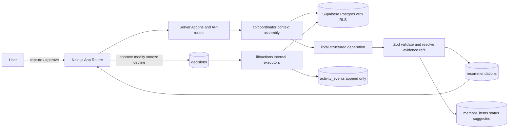
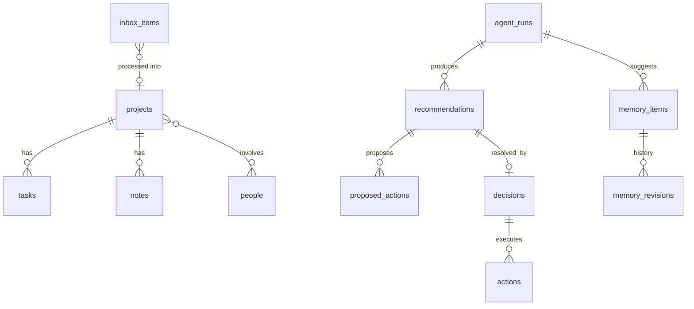

# ASI OS — Implementation Plan

> Approved plan of record for ASI OS (Adaptive Systems Interface).
> Phase 0 is implemented; Phases 1-5 are not started. Update this document when
> the plan changes, and record every consequential deviation as an ADR under
> `docs/DECISIONS/`.

At the time this plan was written, repository `DoofXRPL/ASI.OS` contained only `LICENSE` and a two-line `README.md` on `main` (commit `2e4b7ec`). This is a genuine greenfield build. Northstar (`northstar-capital-superbase/Superbase`) was publicly accessible and inspected read-only in full; findings are folded in below.

---

## 1. What to learn and reuse conceptually from Northstar

Northstar's real value is its written self-critique, not its code. Reuse these ideas, rewritten from scratch:

- **The loop is the product.** Northstar's `NORTHSTAR-OS-VISION.md` §1 states every screen must declare which loop stage it serves. Keep this as a hard review rule.
- **Trust is the interface.** Every recommendation shows who proposed it, what evidence, what confidence, and what happens if you do nothing. Northstar specified this and never fully shipped it.
- **The four-state card rule** from `NORTHSTAR-OS-TRANSITION.md` §4: every surface renders exactly one of real data, empty, not connected, or explicitly-labelled preview. "No card ever shows a fabricated number." This is the single best thing in the repo.
- **Universal decision grammar:** Approve / Modify / Snooze / Why, identical everywhere.
- **Memory transparency as non-negotiable.** Vision §6: "if Northstar ever uses memory the user can't see, edit, or delete, the entire trust thesis collapses."
- **Calm empty states are success, not absence.** "Nothing needs you" is a designed state.
- **Progressive disclosure.** Default to a one-line synthesis; reasoning expands on request. Northstar shipped this well in `components/labs/MessageThread.tsx` (trace collapsed by default).
- **Server-resolved identity only.** `lib/auth/getUser.ts` returns the user *and* their JWT; client-supplied `userId` is never trusted. Carry forward exactly.
- **RLS via caller JWT, never service role.** `lib/memory/supabase-store.ts` passes `Authorization: Bearer <user jwt>` with the anon key so Postgres enforces ownership.
- **Fail-closed middleware.** If Supabase env is missing, protected routes are unreachable rather than open.
- **`safeRedirectPath`** open-redirect defence in `lib/auth/redirect.ts` — small, correct, worth reimplementing.
- **Pure-derivation modules with unit tests** (`lib/dashboard/*`) — business logic as pure functions, tested without a database.
- **Honest "needs owner input" markers** in the UI instead of silently broken features.

## 2. What to redesign or discard

Discard outright:

- All finance, portfolio, brokerage, Robinhood, trading, MCP-trading, pricing and cost-tracking code and copy. Also discard `agents-py/` (an unwired CrewAI mirror), the Docker image, and the marketing showcase with its fake orchestration log (`components/showcase/studio/Landing.tsx:40-49`) and fake "SYNCED" badge (`NorthstarShowcase.tsx:27-28`).
- **The multi-agent crew.** `lib/orchestration/crew.ts` runs orchestrator-plan → 3 sequential specialists → orchestrator-synthesis: five LLM calls per message. The plan phase output never routes anything — `resolveSpecialists()` is config-driven. Their own `PRODUCT_REVIEW.md` flags this as HIGH priority. Start with one agent.
- **Unstructured agent output.** `AgentResult.output` is a plain string. No Zod anywhere in `package.json`. This makes the trust interface impossible to build.
- **Memory as a chat log.** `lab_memory` has `kind ∈ (message, agent_output, fact, plan)`, append-only, injected as one flat `[author] content` blob. No source, status, confidence, or correction history.
- **The "soon" nav.** ~10 of ~14 sidebar items in `components/os/OsSidebar.tsx:51-90` are inert placeholders. Ship a small nav of real routes.
- **Preference theater.** Settings exposes 12 sections where roughly half do nothing — including a model picker offering a nonexistent `"gpt-5.5"` (`components/settings/Settings.tsx:146-149`), a streaming toggle that never disables streaming, and a mic button for unimplemented voice. Rule for ASI: if it isn't wired, it isn't rendered.
- **localStorage as the settings store.** Not portable, not auditable, not RLS-protected.
- **Single `schema.sql` with inline brownfield `ALTER` statements.** Use versioned Supabase migrations.
- **The service-role fallback** in `lib/memory/index.ts:40-56` — `adminKey = SERVICE_ROLE_KEY || anonKey` silently bypasses RLS when no access token is present. Ban service role from all user-data paths; fail loudly instead.
- **Tailwind installed but unused.** `tailwind.config.ts` exists; zero utility classes appear in any `.tsx`. Styling is ~1,000-line plain-CSS monoliths. Pick one strategy and commit.
- **XML-tag tool calling** (`<mcp_call tool="...">{json}</mcp_call>` parsed by regex). Use provider-native tool calling when tools arrive.
- **Deployment-global OAuth tokens.** Northstar's Robinhood token is one env var for the whole deployment, and production OAuth is disabled because of it. Any ASI connection must be per-user and encrypted from day one.
- **Fake isolation tests.** `tests/auth-security.test.ts` tests `safeRedirectPath` and an email allowlist; `tests/memory.test.ts` tests an in-process array. Nothing proves RLS. This is the gap that must not be repeated.

## 3. ASI OS product definition and non-goals

**Definition.** ASI OS is a private personal intelligence and coordination layer. It holds a truthful record of my commitments, projects, decisions and knowledge; it reasons over that record; it proposes next actions with visible evidence; it acts only with permission; and it remembers what I confirmed, corrected and decided.

**The loop, stated honestly for v1:**

- **Observe** — read my own records (inbox, projects, tasks, notes, past decisions). In v1 there are *no* external feeds and the UI must never imply otherwise.
- **Understand** — assemble a bounded, auditable context snapshot: profile memory, confirmed semantic memory, relevant episodic memory, live project/task rows.
- **Recommend** — one Coordinator produces a structured recommendation whose every evidence item points at a real row I own.
- **Approve** — Approve / Modify / Snooze / Decline-with-reason. Nothing consequential happens otherwise.
- **Act** — v1 actions are internal state changes only (create task, change project status, confirm memory). Real, reversible, auditable — no external side effects yet.
- **Remember** — the decision, the reason, the outcome, and any memory candidates I confirm.

**Non-goals (explicit):** no finance/portfolio/trading of any kind; no general-purpose chatbot as the primary surface; no agent zoo; no traditional task manager competing on features; no metric-card dashboard; no public signup, teams, orgs, roles, or billing; no autonomous action without approval; no social or sharing feed; no mobile app; no gamification.

## 4. MVP user experience and information architecture

Navigation shows only shipped routes. Target six at MVP:

- **Today** — one honest sentence of state, then *Needs attention* (ranked recommendations, each with why / evidence / if-you-do-nothing / approve-modify-snooze-decline), then commitments due, then blocked items. When nothing needs me it says so with confidence.
- **Inbox** — one-field capture (text, link, note) with zero required metadata, plus a processing queue: turn into task, note, project, decision-to-make, memory candidate, or archive.
- **Projects** — list, then a project page: intended outcome, status, next action, blockers, tasks, notes, related people.
- **Memory** — three tabs: Profile, Confirmed, Suggested. Every item shows source, when, confidence, times used. Controls: Confirm, Correct, Forget. Correction history visible.
- **Activity** — append-only, human-readable history: agent runs, recommendations, decisions, actions, failures, memory changes. Filterable.
- **Settings** — identity, privacy, permissions, model/behaviour. Every control wired or absent.

Added in Phase 2 and 3 respectively, because they are cheap views over tables that already exist: **Decisions** (resolved recommendations with what was proposed, decided, why, and what happened) and **Connections** (approved external tools and exact read/write scopes). Connections does not appear in nav until one integration actually works.

**Deliberate simplifications to your brief:**

- **Decisions is a filtered projection, not a subsystem.** It reads `recommendations` + `decisions` + `actions`. Do not build separate storage.
- **No chat box until Phase 4.** The Coordinator is invoked from Today and from a project — in context, about something specific. A free-text box on day one is the fastest route to "generic chatbot with extra steps."
- **Confidence is `low | medium | high`.** A 0–1 float is fake precision the model cannot honestly produce.
- **Working memory is not a store.** It is the assembled context for a single run, persisted once as `agent_runs.context_snapshot` for auditability. Three durable memory kinds, one table.

## 5. Recommended system architecture

Four layers with a strict dependency direction: `components/` → `app/api/` and server actions → `lib/` → Supabase. The client never imports `lib/` (Northstar's best invariant, from `docs/ARCHITECTURE.md`).

- **Framework:** latest stable Next.js App Router, TypeScript strict. Every authenticated page is dynamic; no PPR, no Cache Components, no `use cache` in v1 — the data is per-user and mutable, and caching would only create staleness bugs.
- **Data:** Supabase Postgres. All reads/writes as the caller via anon key + user JWT so RLS is the enforcement boundary. Service role restricted to migrations and the invite-admin path, never to user data.
- **Migrations:** Supabase CLI versioned migrations in `supabase/migrations/`. Local Supabase in CI.
- **AI layer:** a thin internal facade `lib/ai/` exposing `generateStructured(schema, prompt, opts)` and later `streamText`. Implement it over the Vercel AI SDK (`ai`, `@ai-sdk/anthropic`, `@ai-sdk/openai`) rather than hand-rolling two SDK clients: it gives provider independence, Zod-validated structured output, and streaming for free. The facade keeps the SDK swappable — this is the tradeoff I'd flag for your approval (see §17).
- **Validation:** Zod at every boundary — form input, API bodies, and *especially* model output.
- **Styling:** Tailwind v4 with semantic design tokens in `@theme`, plus shadcn/ui for primitives that are hard to get right (Dialog, Popover, Command, Dropdown). Committing fully to one system avoids Northstar's worst-of-both outcome.
- **Deliberately absent in v1:** vector database, queue, background worker, Realtime, Edge Functions, cron, Redis, feature-flag service, analytics. Each is listed with its trigger condition in §18.



## 6. Proposed repository and folder structure

```
app/
  (public)/login, invite/[token]
  (os)/layout.tsx            # shell: nav + runtime status
    today/, inbox/, projects/, projects/[id]/,
    memory/, activity/, settings/
  auth/callback/route.ts
  api/coordinator/route.ts   # thin; delegates to lib/
  api/health/route.ts
lib/
  ai/            provider facade, model config, prompt builders
  coordinator/   run pipeline, context assembly, output validation, evidence resolver
  memory/        repository, lifecycle transitions, retrieval
  actions/       internal action executors + registry
  db/            typed queries per entity (inbox, projects, tasks, recs, decisions)
  audit/         activity event writer
  supabase/      browser, server, middleware clients + env guard
  auth/          getAuthedUser, owner guard, safeRedirectPath
  schemas/       shared Zod schemas (single source of truth for types)
  derive/        pure functions: ranking, "needs attention", staleness
components/
  ui/            primitives
  os/            AppShell, Nav, RuntimeStatus, EmptyState, Honesty states
  today/ inbox/ projects/ memory/ activity/ settings/
  recommendation/  RecommendationCard, EvidenceList, WhyDisclosure, ApprovalBar
supabase/migrations/
tests/
  unit/          pure logic + Zod contracts
  rls/           integration against local Supabase, two real users
docs/
  PRINCIPLES.md ARCHITECTURE.md DATA-MODEL.md DECISIONS/ (ADRs)
AGENTS.md .env.example
```

## 7. Database schema and relationships

Every table: `id uuid pk`, `user_id uuid not null references auth.users(id) on delete cascade`, `created_at`, `updated_at`. RLS enabled on all, policy `(select auth.uid()) = user_id`, with `user_id` indexed. No nullable ownership anywhere — Northstar's nullable `lab_memory.user_id` is a latent leak.

- **`profiles`** — display name, timezone, owner flag. Auto-provisioned by an `on auth.users insert` trigger (reuse Northstar's `handle_new_user` pattern).
- **`inbox_items`** — `content`, `kind (thought|task|note|link|question)`, `status (unprocessed|processed|archived)`, `processed_into_type`, `processed_into_id`, `source (manual|agent)`.
- **`projects`** — `name`, `outcome`, `status (active|paused|blocked|done|abandoned)`, `next_action`, `priority`, `target_date`, `last_touched_at`.
- **`tasks`** — `project_id nullable`, `title`, `status (todo|doing|blocked|done|dropped)`, `due_at`, `blocked_reason`, `blocked_by_task_id`, `estimate`.
- **`notes`** — `title`, `body`, polymorphic `subject_type` / `subject_id`.
- **`people`** — `name`, `relationship`, `context`; `project_people` join table.
- **`memory_items`** — `kind (profile|semantic|episodic)`, `content`, `status (suggested|confirmed|rejected|superseded|forgotten)`, `source_kind (user_stated|user_edited|derived_from_entity|inferred_by_model)`, `source_refs jsonb`, `confidence (low|medium|high)`, `confirmed_at`, `superseded_by_id`, `times_used`, `last_used_at`, `forgotten_at`. Full-text `tsvector` generated column + GIN index.
- **`memory_revisions`** — append-only: `memory_item_id`, `revision_type (created|confirmed|corrected|rejected|superseded|forgotten)`, `previous_content`, `new_content`, `reason`, `actor (user|agent)`.
- **`agent_runs`** — `trigger (user_request|page_load|scheduled)`, `status (running|succeeded|failed|invalid_output)`, `model`, `context_snapshot jsonb`, `raw_output jsonb`, `validation_errors jsonb`, `latency_ms`, `token_usage jsonb`.
- **`recommendations`** — `agent_run_id`, `summary`, `reasoning`, `evidence jsonb` (array of resolved refs), `assumptions text[]`, `confidence`, `if_you_do_nothing`, `approval_required bool`, `status (pending|approved|modified|snoozed|declined|expired)`, `priority`, `subject_type`, `subject_id`, `snoozed_until`.
- **`proposed_actions`** — `recommendation_id`, `action_type`, `params jsonb`, `description`, `reversible bool`.
- **`decisions`** — `recommendation_id nullable` (so standalone decisions can be logged manually), `title`, `resolution (approved|modified|snoozed|declined)`, `reason`, `decided_by`, `decided_at`, `modified_params jsonb`, `outcome_note`, `outcome_recorded_at`.
- **`actions`** — `decision_id`, `action_type`, `params jsonb`, `status (pending|succeeded|failed|reverted)`, `result jsonb`, `error`, `executed_at`, `reverted_at`.
- **`activity_events`** — append-only audit: `event_type`, `subject_type`, `subject_id`, `summary`, `detail jsonb`, `actor (user|agent|system)`. Insert-only policy; no update or delete policy at all.
- **`user_settings`** — one row per user, typed JSONB validated by Zod on read and write. In Postgres, not localStorage.
- **`invitations`** (Phase 5) — `email`, `token_hash`, `invited_by`, `expires_at`, `accepted_at`, `revoked_at`.
- **`connections`** (Phase 5) — `provider`, `scopes text[]`, `can_read bool`, `can_write bool`, `encrypted_credentials`, `status`, `last_verified_at`.



## 8. Authentication, invitations, privacy, sharing, RLS

- **Auth:** Supabase email + password, PKCE callback at `app/auth/callback/route.ts`. Self-signup **disabled in the Supabase dashboard** from day one — this, not application code, is the real gate.
- **Owner bootstrap:** the single owner account is created manually in Supabase. `ASI_OWNER_EMAIL` guards owner-only routes (invitations, diagnostics).
- **Middleware:** protects the `(os)` route group, fails closed when Supabase env is absent, forwards refreshed session cookies onto redirects, sanitises the `redirect` param.
- **Server identity:** a single `getAuthedUser()` returning `{ id, email, accessToken }`. All DB access uses that token. Client-supplied identity is never accepted.
- **Isolation:** RLS is the boundary. Application-level `user_id` filters are defence in depth only, never the mechanism.
- **Service role:** used only by migrations and the invite-admin server route. Add a CI grep asserting `SERVICE_ROLE` appears in no file under `lib/db/`, `lib/memory/`, or `lib/coordinator/`.
- **Invitations (Phase 5):** owner creates an invitation → `inviteUserByEmail` via the admin client in an owner-guarded route → invitee sets a password at `/invite/[token]` → gets a fully private space with nothing shared.
- **Sharing (Phase 5, deliberately minimal):** a `shares` table granting `(entity_type, entity_id, shared_with_user_id, permission read|comment)`. Per-entity, opt-in, revocable. **No workspaces, no orgs, no membership tables** — that model costs an RLS rewrite and buys nothing for two or three trusted people. Shared entities are visually marked as shared everywhere they appear.
- **Privacy:** default private; every read path returns only owned-or-explicitly-shared rows; Settings offers full export and full delete.

## 9. Agent orchestration design

**One agent: the ASI Coordinator.** No specialists at MVP. Not one. Northstar proves a roster is easy to add and hard to justify.

Pipeline (`lib/coordinator/run.ts`), each step individually testable:

1. **Guard** — authenticate, validate input, rate-limit per user (per-user, in Postgres — Northstar's in-process `Map` is useless on serverless).
2. **Assemble context** — profile memory, confirmed semantic memory, top-k relevant episodic memory, live rows for the subject, recent decisions. Bounded by token budget. Persisted verbatim as `agent_runs.context_snapshot`.
3. **Generate** — one structured call via `lib/ai`, Zod schema enforced.
4. **Validate** — schema parse; then **resolve every evidence ref against the database as the caller**. A ref that does not resolve to a row the user owns is dropped and recorded in `validation_errors`. If zero evidence survives, the run is marked `invalid_output` and the UI says so instead of showing a recommendation. **This is the mechanism that makes "never fabricate" enforceable rather than aspirational.**
5. **Persist** — `recommendations` + `proposed_actions` + `memory_items(status='suggested')` + `activity_events`.

Output contract (`lib/schemas/coordinator.ts`):

```ts
const CoordinatorOutput = z.object({
  summary: z.string().min(1).max(280),
  reasoning: z.string(),
  evidence: z.array(z.object({
    ref: z.object({ type: EntityType, id: z.string().uuid() }),
    why_relevant: z.string(),
  })).min(1),
  assumptions: z.array(z.string()),
  confidence: z.enum(['low', 'medium', 'high']),
  if_you_do_nothing: z.string(),
  proposed_actions: z.array(z.object({
    action_type: ActionType,          // closed enum, server-registered
    params: z.record(z.unknown()),    // re-validated per action_type
    description: z.string(),
    reversible: z.boolean(),
  })).max(3),
  approval_required: z.boolean(),
  memory_candidates: z.array(z.object({
    kind: z.enum(['profile', 'semantic', 'episodic']),
    content: z.string(),
    source_refs: z.array(EntityRef),
    confidence: z.enum(['low', 'medium', 'high']),
  })).max(5),
});
```

`approval_required` is advisory only. The **server** decides, from the action registry: every action that mutates or has an external effect requires approval regardless of what the model claims. A model must never be able to talk its way out of an approval gate.

Specialists are **Later**, and each must earn entry with a distinct tool boundary (e.g. a Research specialist only once web access exists). A Memory Curator is **Not now** — curation is a deterministic job, not an agent.

## 10. Memory lifecycle and retrieval

- **Profile** — identity and stable preferences. Only ever user-authored or user-confirmed. Always injected.
- **Semantic** — confirmed facts. Injected only when `status='confirmed'`.
- **Episodic** — events, conversations, decisions, outcomes. Written by the system as a record of what happened; retrieved by relevance.
- **Working** — not stored as memory; it is `agent_runs.context_snapshot`.

Lifecycle: `suggested → confirmed | rejected`; `confirmed → superseded` (correction creates a new item and links `superseded_by_id`) or `→ forgotten`. Every transition writes a `memory_revisions` row. Forget sets `forgotten_at`, clears content, and retains the revision trail so the *fact of forgetting* is auditable without the content.

**The hard rule: `suggested` memory is never injected into a prompt.** It is visible in the Memory inbox and inert until confirmed. This is what makes "memory is visible, sourced, editable, forgettable" true rather than decorative.

Retrieval in v1 is deliberately boring and explainable: Postgres full-text search over `content` + kind filter + recency decay + `times_used` boost, top-k with a token budget. Every injected item is recorded in the context snapshot so the UI can show exactly which memories a recommendation used, and `times_used` / `last_used_at` are incremented on use. **pgvector is Later**, gated on a measured failure of keyword retrieval.

## 11. Recommendation, approval, action, audit lifecycle

`agent_run → recommendation (+ proposed_actions) → decision → action(s) → activity_events`, with memory candidates branching off the run.

- Every recommendation renders: summary, confidence, **why it matters**, **if you do nothing**, evidence as clickable links to real records, assumptions, and the memories it used (collapsed).
- Four verbs everywhere: **Approve**, **Modify** (edit params before approving), **Snooze** (with a reason, captured), **Decline** (reason required — this is the highest-value training signal in the system).
- Approval writes a `decision`, then executes each `proposed_action` through a **server-side action registry**. An action type not in the registry cannot run. Each executor declares `requires_approval` and `reversible`, and writes an `actions` row plus an `activity_event`.
- v1 action types are internal and reversible: `create_task`, `update_task_status`, `set_project_next_action`, `update_project_status`, `create_note`, `archive_inbox_item`, `confirm_memory`. Reversible actions offer Undo for a real window.
- Failures are first-class: `actions.status='failed'` with the error surfaced in Activity and on the originating recommendation. Silent failure is a bug.
- `activity_events` is insert-only at the policy level and never edited.
- Outcome capture: a decision can later record `outcome_note`, closing the Remember stage honestly.

## 12. Page and component structure

- **Shell** — `components/os/AppShell` with a compact nav (no "soon" items) and a truthful runtime status line (model configured / not configured / unreachable), fetched once via one shared provider. Northstar fetched runtime status three times on one page; use a single provider and one data-fetching approach throughout.
- **Today** — `StateOfThings` (one sentence), `NeedsAttention` (list of `RecommendationCard`), `Commitments`, `Blocked`, `CalmState`.
- **RecommendationCard** — the most important component in the product: header, confidence chip, `WhyDisclosure`, `IfYouDoNothing`, `EvidenceList` (links to real rows), `MemoryUsed` (collapsed), `ApprovalBar`. Everything else can be plain.
- **Inbox** — `CaptureBar` (always focusable, optimistic), `InboxList`, `ProcessSheet`.
- **Projects** — `ProjectList`, `ProjectHeader` (outcome + status + next action), `TaskList`, `BlockerList`, `NoteList`, `PeopleList`.
- **Memory** — `MemoryTabs`, `MemoryItemCard` (source, confidence, times used, Confirm / Correct / Forget), `CorrectDialog`, `RevisionHistory`.
- **Activity** — `ActivityStream` with type filters and expandable detail.
- **Settings** — Identity, Privacy & data (export/delete), Model & behaviour, Appearance. Nothing unwired.
- **Primitives** — Button, Input, Textarea, Select, Dialog, Popover, DropdownMenu, Badge, Card, Skeleton, EmptyState, Disclosure, Toast. Roughly fifteen; resist growth.

## 13. Honest empty, loading, disconnected, failure states

One shared vocabulary, four states, applied to every surface — extending Northstar's card rule:

- **Empty (calm):** "Nothing needs you. 3 projects active, next commitment Friday." A designed, confident state.
- **Empty (never used):** a single concrete first step, not a marketing tour.
- **Loading:** skeletons that match final layout. Never a zero or a dash that could be mistaken for real data.
- **Not configured:** "No model key configured — ASI can hold your records but cannot recommend yet." Explains impact and remedy.
- **Not connected:** shown only on Connections, only for integrations that exist.
- **Failed:** what failed, what it means, what to do, and a retry. Recorded in Activity.
- **Degraded / invalid output:** "ASI produced a recommendation that failed verification. Nothing was shown." Visible in Activity with the validation errors.

Banned: fabricated numbers, "coming soon" nav items, unwired controls, decorative affordances for unimplemented features, and success states that were never verified. Northstar shipped an asserted "SSE ready" row and an unverified GitHub connection; both are exactly the pattern to avoid.

## 14. Testing and security strategy

- **Unit (Vitest):** pure derivations in `lib/derive/`, Zod contracts, memory lifecycle transitions, action registry gating, `safeRedirectPath`, evidence resolution rejecting unowned refs.
- **RLS integration (the non-negotiable gate):** local Supabase via CLI in CI; create two real users; for every table assert user B's SELECT of A's rows returns zero rows, INSERT with A's `user_id` fails, UPDATE and DELETE of A's rows affect zero rows. A new table without an RLS test fails review. This is precisely what Northstar never had.
- **AI contract tests:** a fake provider (Northstar's `tests/fake-provider.ts` is a good shape) returning valid, invalid, and malicious outputs (evidence pointing at another user's UUID, an unregistered `action_type`, `approval_required: false` on a mutating action). Each must be rejected safely.
- **E2E (Playwright, from Phase 2):** the loop — sign in, capture, recommendation appears, approve, action lands, activity records it.
- **CI:** typecheck → lint → unit → RLS → build. Plus the service-role grep guard and a check that migrations apply cleanly to an empty database.
- **Security posture:** all secrets server-only; per-user rate limits in Postgres; input length caps; no user content in logs; encrypted per-user credentials for connections; `activity_events` insert-only; owner-only routes guarded server-side; RLS never bypassed for user data.

## 15. Phased implementation roadmap

- **Phase 0 — Foundation and security spine.** Scaffold, Tailwind + tokens, Supabase local + first migration (`profiles`, `user_settings`, `activity_events`), auth + middleware + owner guard, app shell with real nav, empty honest pages, CI, RLS harness with two users, `docs/PRINCIPLES.md` + `AGENTS.md` + `.env.example`.
- **Phase 1 — Manual system of record (no AI).** Inbox capture and processing; Projects with outcome / status / next action / blockers / tasks / notes / people; Today derived **deterministically** from real rows; Activity logging user actions; Settings identity + export/delete. **The product is genuinely useful here with zero AI and zero integrations.**
- **Phase 2 — The loop.** `lib/ai` facade, Coordinator, output contract, evidence resolution, recommendations on Today, four-verb approval, decisions, internal action registry with Undo, Decisions page, full audit. Memory candidates captured but inert.
- **Phase 3 — Memory.** Memory page with three tabs, Confirm / Correct / Forget, revision history, retrieval feeding the Coordinator, "memories used" on every recommendation, `times_used` tracking.
- **Phase 4 — Briefing and Ask.** Streaming narrative daily briefing (generated once per day, stored, regenerable), a ⌘K command palette, and an Ask surface that returns the *same* structured contract — never a bare chat reply.
- **Phase 5 — Connections and invitations.** One real read-only integration (calendar is the highest-value first choice) with per-user encrypted credentials and explicit scopes; then invitations and per-entity sharing.

## 16. Definition of done per phase

- **Phase 0:** owner signs in and reaches Today; unauthenticated access redirects; missing Supabase env makes protected routes unreachable; migrations apply to an empty DB; RLS tests prove isolation on all three tables; CI green; no placeholder UI anywhere.
- **Phase 1:** capture a thought in under three seconds; process it into a task on a project; Today shows only real derived items and a calm state when empty; every mutation appears in Activity; export returns all my data; RLS tests cover every new table; deterministic derivations unit-tested.
- **Phase 2:** a recommendation appears on Today with evidence links that resolve to real rows; Why and If-you-do-nothing are present; Approve executes a real reversible internal action and Undo works; Decline records a reason; every step in Activity; a model output with fabricated evidence is rejected and visibly reported, proven by test; no action outside the registry can execute.
- **Phase 3:** confirm, correct and forget all work with visible history; recommendations list which memories they used; suggested memory provably never enters a prompt (test); forgotten memory provably never returns (test).
- **Phase 4:** briefing streams, is stored, and is regenerable; ⌘K navigates and captures; Ask returns the structured contract with approval gates intact.
- **Phase 5:** connection shows exactly what it may read and change; revoking it deletes credentials and stops all reads; an invited second user provably sees none of the owner's data (RLS test); shared entities are visibly marked.

## 17. Risks and decisions I need from you

1. **AI SDK vs hand-rolled provider layer.** I recommend the Vercel AI SDK behind a thin `lib/ai/` facade — provider independence, Zod structured output and streaming without writing three integrations. The tradeoff is a dependency in the hot path. Approve, or should I hand-roll like Northstar did?
2. **Tailwind v4 + shadcn/ui, or plain CSS with tokens?** I recommend Tailwind + shadcn for velocity and accessibility. Northstar's bespoke dark aesthetic came from ~1,000-line plain-CSS files that its own review flagged as unmaintainable. If the exact Northstar look matters to you, say so and I'll plan tokens-plus-plain-CSS instead.
3. **Model and budget.** Which provider and model tier should the Coordinator default to? Northstar defaulted to a top-tier model across five calls per message and its review called that out as slow and expensive.
4. **Supabase project.** Do you have an existing project for ASI, or should Phase 0 target local Supabase only and defer the hosted project? I have no Supabase credentials in this environment.
5. **Is deterministic Today acceptable for Phase 1?** I want Today useful before any LLM is involved. This means Phase 1 ships with no AI at all. Confirm that is the right sequencing.
6. **Decisions page scope.** Confirm it is a projection over `recommendations`/`decisions`/`actions`, and that you also want to log *manual* decisions made outside a recommendation.
7. **First integration for Phase 5.** Calendar is my recommendation (highest signal for "commitments", read-only is safe). Email is higher value but much higher privacy and volume cost.
8. **Zero specialists at MVP.** Confirm you accept one Coordinator only, with specialists gated behind a distinct tool boundary.

## 18. Feature classification and the first vertical slice

**MVP (Phases 0–3):** auth with self-signup disabled; RLS on everything with tests; Inbox capture and processing; Projects with outcome/status/next action/blockers/tasks/notes/people; deterministic Today; single Coordinator with Zod contract; evidence resolution against real rows; four-verb approval; internal reversible action registry; decisions and outcome capture; append-only activity; three memory kinds with confirm/correct/forget and revision history; keyword+recency retrieval; honest state vocabulary; Settings with export and delete; CI with typecheck/lint/unit/RLS/build.

**Later:** streaming briefing; ⌘K; Ask surface; Connections with per-user encrypted credentials; invitations; per-entity sharing; specialist agents behind real tool boundaries; pgvector (only on measured retrieval failure); scheduled briefing via Vercel Cron; Playwright E2E; autonomy dial for pre-approved low-risk actions; mobile-optimised approval flow; Undo window tuning.

**Not now:** any finance/portfolio/trading; public signup; teams, orgs, roles, billing; agent marketplace; voice; realtime collaboration; queues and background workers; Edge Functions; node-graph workflow builder; local-first memory; native mobile app; analytics; multi-tenant workspaces; autonomous action without approval; MCP.

**The smallest useful first vertical slice** (the Phase 0 PR, and the exact scope of the first implementation PR):

- Next.js App Router + TypeScript strict + Tailwind v4 with tokens; ESLint; Vitest; Playwright config only (no tests yet).
- Supabase local config and migration `0001_foundation.sql`: `profiles`, `user_settings`, `activity_events`, all with RLS, indexes, `handle_new_user` trigger, `set_updated_at` trigger, insert-only policy on `activity_events`.
- `lib/supabase/{browser,server,middleware,env}.ts`, `lib/auth/{getAuthedUser,ownerGuard,safeRedirectPath}.ts`, `middleware.ts` protecting `(os)` and failing closed.
- `/login`, `/auth/callback`, `(os)/layout.tsx` shell with real nav, and honest empty `today`, `inbox`, `projects`, `memory`, `activity`, `settings` pages — each stating plainly that it holds nothing yet, with no fake data and no "coming soon."
- `components/ui` primitives (~8) and `components/os/{AppShell,Nav,RuntimeStatus,EmptyState}`.
- `lib/audit/log.ts` and `lib/schemas/` foundations.
- Tests: `tests/rls/isolation.test.ts` creating two real users and proving zero cross-user access on all three tables; unit tests for `safeRedirectPath` and settings schema validation.
- CI workflow: typecheck → lint → unit → RLS (local Supabase) → build; plus the service-role grep guard.
- `README.md`, `AGENTS.md`, `.env.example`, `docs/PRINCIPLES.md`, `docs/ARCHITECTURE.md`, `docs/DATA-MODEL.md`, `docs/DECISIONS/0001-single-coordinator.md`.

No AI, no external calls, no fake data. It ends with a real signed-in owner looking at a truthful empty system whose isolation is proven by tests — the only foundation on which the trust claims of this product can be built.

---

## Recommended architecture, in one paragraph

Next.js App Router with TypeScript strict; Supabase Postgres where RLS is the only isolation boundary and the service role never touches user data; versioned migrations with a two-user RLS test suite as a CI gate; a thin `lib/ai` facade over the Vercel AI SDK exposing Zod-validated structured generation; one ASI Coordinator whose every evidence reference is resolved against real rows the user owns before anything is shown; a server-side action registry that decides what needs approval regardless of what the model claims; three durable memory kinds in one table with a revision trail, where suggested memory is inert until confirmed; an append-only activity log; Tailwind v4 with shadcn primitives; and no queue, worker, vector database, realtime layer, or cron until a measured need appears.
